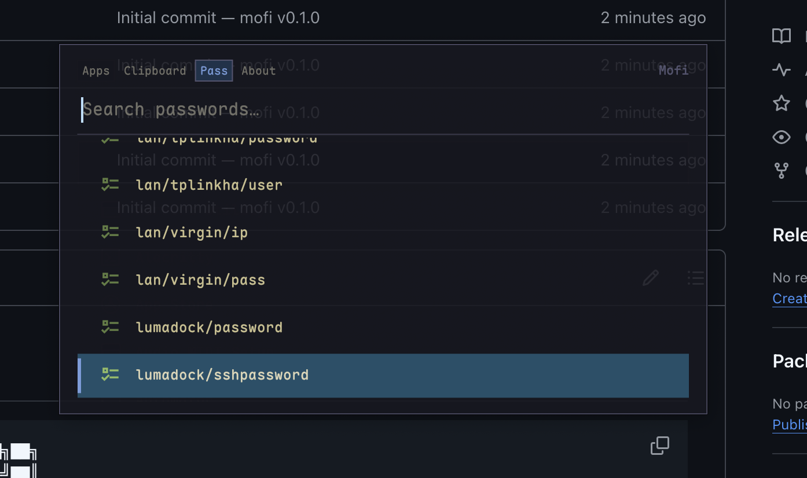
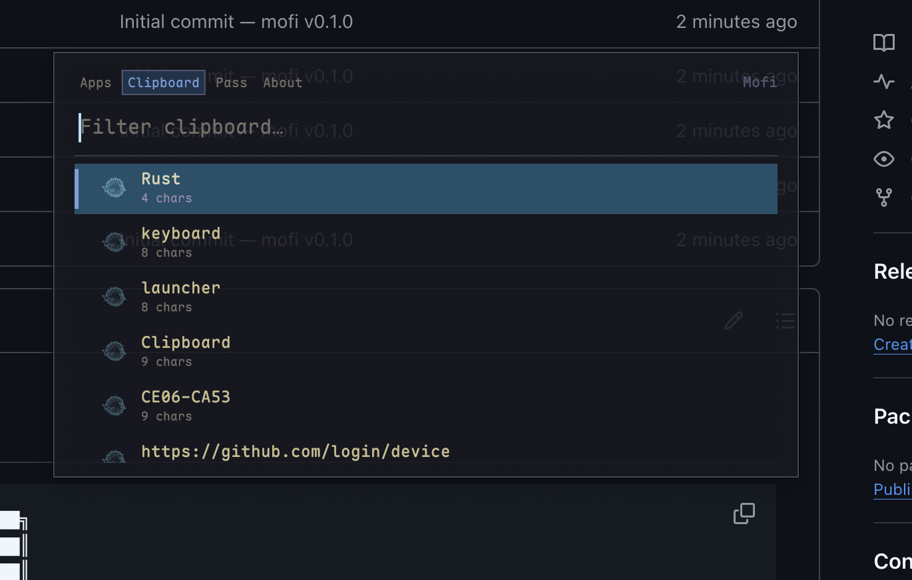
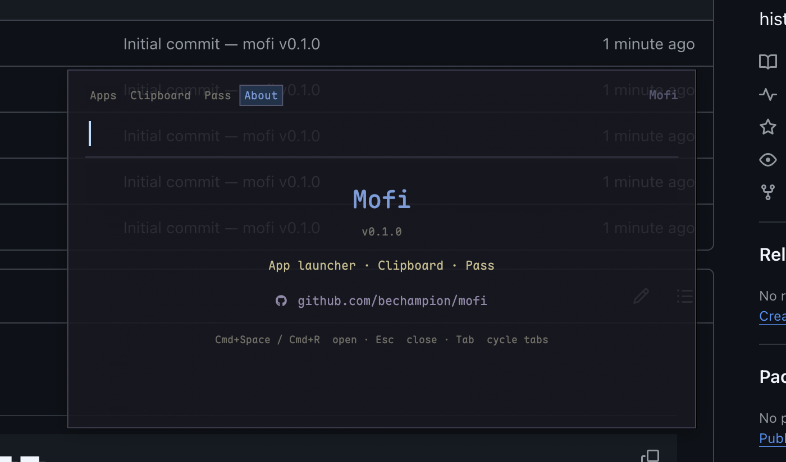
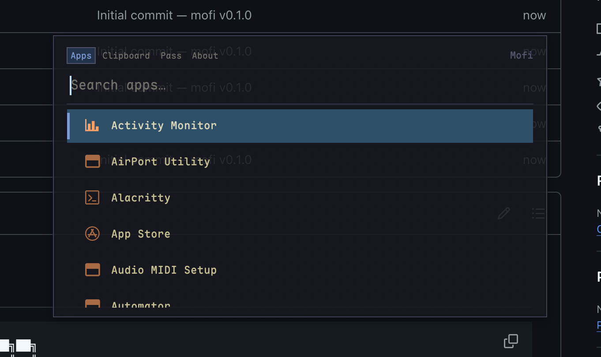

# mofi

```
 ███╗   ███╗ ██████╗ ███████╗██╗
 ████╗ ████║██╔═══██╗██╔════╝██║
 ██╔████╔██║██║   ██║█████╗  ██║
 ██║╚██╔╝██║██║   ██║██╔══╝  ██║
 ██║ ╚═╝ ██║╚██████╔╝██║     ██║
 ╚═╝     ╚═╝ ╚═════╝ ╚═╝     ╚═╝
```

> A fast, keyboard-driven launcher for macOS — built with Rust + egui.  
> App launcher · Clipboard history · Password Store integration · Theme picker · Pipe-select mode.

---

## Features

- **App launcher** — fuzzy-search all installed `.app` bundles across `/Applications`, `/System/Applications`, and `~/Applications`
- **Clipboard history** — persistent, searchable history of everything you've copied (up to 100 entries)
- **Pass integration** — browse and copy passwords from your `~/.password-store` via [`pass`](https://www.passwordstore.org/) and `pinentry-mac`
- **Theme picker** — 10 built-in themes with live preview; switch instantly from the Themes tab or `mofi --themes`
- **Pipe-select mode** — `mofi --input` reads lines from stdin, presents them as a fuzzy-searchable list, and prints the selected line to stdout (exit 0) or exits 1 on cancel
- **Maple Mono NF** — Nerd Font glyphs for every icon, no PNG loading
- **Daemon architecture** — persistent background process toggled via `skhd`; no Dock icon, no Cmd-Tab entry (`NSApplicationActivationPolicyAccessory`)
- **Focus restore** — returns focus to the previously active app on dismiss

---

## Screenshots






---

## Requirements

| Tool | Purpose |
|------|---------|
| [Rust](https://rustup.rs) | Build toolchain |
| [skhd](https://github.com/koekeishiya/skhd) | Global hotkey daemon |
| [pass](https://www.passwordstore.org/) | Password store (optional) |
| [pinentry-mac](https://formulae.brew.sh/formula/pinentry-mac) | GPG PIN entry for pass (optional) |
| Maple Mono NF | Font — place `MapleMono-NF-Regular.ttf` and `MapleMono-NF-Medium.ttf` in `~/Library/Fonts/` |

```bash
brew install skhd pass pinentry-mac
```

---

## Build

```bash
git clone https://github.com/bechampion/mofi
cd mofi
cargo build --release
# binary at: target/release/mofi
```

Pre-built binaries for macOS (Apple Silicon and Intel) are available on the [Releases](https://github.com/bechampion/mofi/releases) page.

---

## Setup

### Quick install

After building, run:

```bash
cargo build --release
./target/release/mofi --install
```

`--install` does everything automatically:

1. Writes `~/Library/LaunchAgents/com.user.mofi.plist` pointing at the current binary and loads it via `launchctl` — the daemon starts immediately and survives reboots.
2. Appends a `cmd - space` hotkey to `~/.skhdrc` (only if a `# mofi` block isn't already present) and reloads `skhd`.
3. Creates `~/.config/mofi/config.toml` with `theme = "kanagawa"` if it doesn't exist yet.

Re-running `--install` after rebuilding the binary is safe — it unloads the old agent before overwriting the plist.

### Manual setup

<details>
<summary>Expand for manual instructions</summary>

#### launchd plist

Save the following to `~/Library/LaunchAgents/com.user.mofi.plist` (replace the path):

```xml
<?xml version="1.0" encoding="UTF-8"?>
<!DOCTYPE plist PUBLIC "-//Apple//DTD PLIST 1.0//EN" "http://www.apple.com/DTDs/PropertyList-1.0.dtd">
<plist version="1.0">
<dict>
    <key>Label</key>
    <string>com.user.mofi</string>
    <key>ProgramArguments</key>
    <array>
        <string>/path/to/mofi/target/release/mofi</string>
        <string>--daemon</string>
    </array>
    <key>RunAtLoad</key>
    <true/>
    <key>KeepAlive</key>
    <true/>
    <key>StandardOutPath</key>
    <string>/tmp/mofi-daemon.log</string>
    <key>StandardErrorPath</key>
    <string>/tmp/mofi-daemon.log</string>
</dict>
</plist>
```

```bash
launchctl load ~/Library/LaunchAgents/com.user.mofi.plist
```

#### skhd hotkey

Add to `~/.skhdrc`:

```
# mofi
cmd - space : /path/to/mofi/target/release/mofi --client
```

```bash
skhd --reload
```

#### pass + pinentry-mac (optional)

```bash
brew install pass pinentry-mac
```

Add to `~/.gnupg/gpg-agent.conf`:

```
pinentry-program /opt/homebrew/bin/pinentry-mac
```

```bash
gpgconf --kill gpg-agent
```

</details>

---

## Keybindings

| Key | Action |
|-----|--------|
| `Cmd+Space` | Open mofi (via skhd) |
| `Escape` | Close / dismiss |
| `Tab` | Cycle tabs: Apps → Clipboard → Pass → Themes → About |
| `↓` / `Ctrl+J` | Move selection down |
| `↑` / `Ctrl+K` | Move selection up |
| `Enter` / double-click | Launch / copy / confirm selected item |

---

## Themes

10 built-in themes: `kanagawa` (default), `gruvbox`, `nord`, `tokyonight`, `dracula`, `solarized`, `monokai`, `catppuccin`, `onedark`, `rosepine`.

**From the UI** — click the `󰔿  Themes` tab or Tab-cycle to it. Navigate with `↑`/`↓` or `Ctrl+K`/`Ctrl+J` for a live preview. Press `Enter` to confirm, `Escape` to cancel and restore the previous theme.

**From the command line:**

```bash
mofi --themes
```

The active theme name is saved to `~/.config/mofi/config.toml`:

```toml
theme = "kanagawa"
```

---

## Pipe-select mode (`--input`)

`mofi --input` turns mofi into a general-purpose fuzzy picker. Feed it lines on stdin; it presents them in the launcher UI and prints the selected line to stdout.

```bash
# Pick a git branch and check it out
git branch | mofi --input | xargs git checkout

# Pick a running process and kill it
ps aux | awk '{print $2, $11}' | mofi --input | awk '{print $1}' | xargs kill
```

Exit codes: `0` = item selected (selected text on stdout), `1` = cancelled.

---

## Architecture

```
mofi --daemon     persistent egui window (hidden by default), started via launchd
mofi --client     toggle show/hide — sends socket message then SIGUSR1
mofi --input      pipe-select: reads stdin, sends items to daemon, prints selection to stdout
mofi --themes     theme picker: presents built-in themes with live preview, writes chosen theme to config
mofi --install    install plist, load launchd agent, append skhd hotkey, create config
mofi --restart    unload and reload the launchd agent, then print the new daemon PID
```

### `--restart`

Restarts the running daemon without touching the launchd plist or any config files.
Use it whenever you rebuild the binary and want the new version to take effect immediately:

```sh
cargo build --release
~/rofi-mac/target/release/mofi --restart
# → [restart] unloading... ok
# → [restart] loading...   ok
# → [restart] daemon running (PID 12345)
```

Internally it runs:

```sh
launchctl unload ~/Library/LaunchAgents/com.user.mofi.plist
launchctl load  ~/Library/LaunchAgents/com.user.mofi.plist
```

and then reads `/tmp/mofi.pid` to confirm the new PID.

Communication uses a Unix socket at `/tmp/mofi.sock`. The daemon PID is written to `/tmp/mofi.pid`.

When a Pass entry is selected, the daemon sends the entry name back to the `--client` process, which runs `pass show <name>` (so `pinentry-mac` can prompt for the GPG passphrase with a proper GUI dialog) and pipes the first line to `pbcopy`.

### IPC protocol

| Message | Direction | Description |
|---------|-----------|-------------|
| `ready\n` | client → daemon | Toggle show/hide; wait for a pass-entry name in response |
| `input\t<l1>\t<l2>\t...\n` | client → daemon | Pipe-select mode |
| `themes\t<l1>\t<l2>\t...\n` | client → daemon | Theme-picker mode (live preview enabled) |
| `ok:<selected>\n` | daemon → client | Item was selected |
| `cancel\n` | daemon → client | User dismissed without selecting |

---

## Colour palette

The default `kanagawa` theme uses strictly named palette tokens from [Kanagawa](https://github.com/rebelot/kanagawa.nvim). All other themes use the same `Theme` struct — background, foreground, accent, border, separator, and row-highlight colours are all configurable per theme in `src/config.rs`.

---

## License

MIT
